# SNES PPU Corruption Engine

Generative art engine that simulates the Super Nintendo PPU at the bit level, then applies controlled corruption algorithms to create evolving abstract visuals. 38 scenes, 21 glitch algorithms, 10 landscape biomes, 8 tile morph phases. Runs entirely in the browser — no dependencies, no build step.

Built for CRT art installations with PS5 controller input.

<p align="center">
  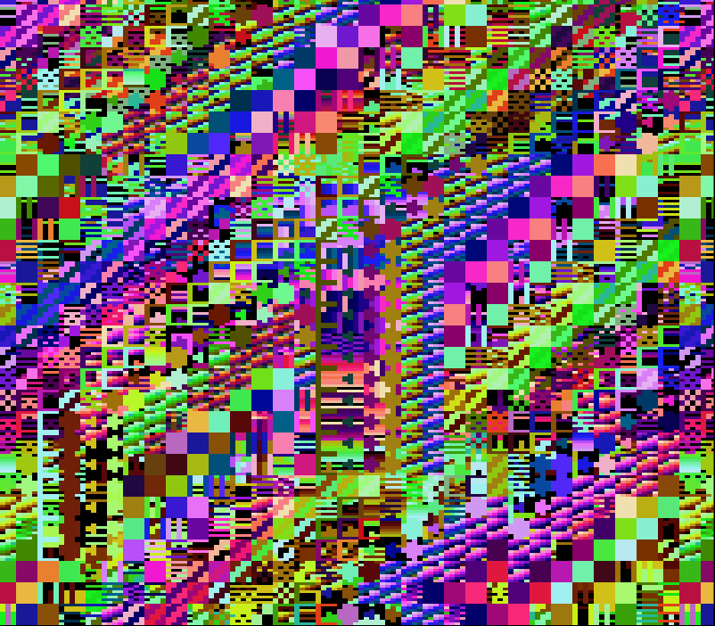
  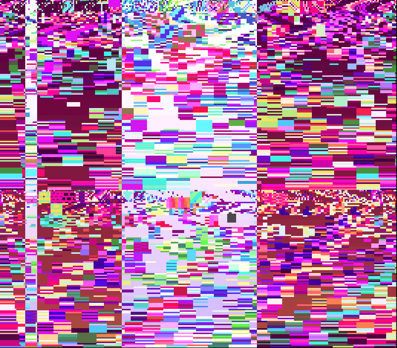
  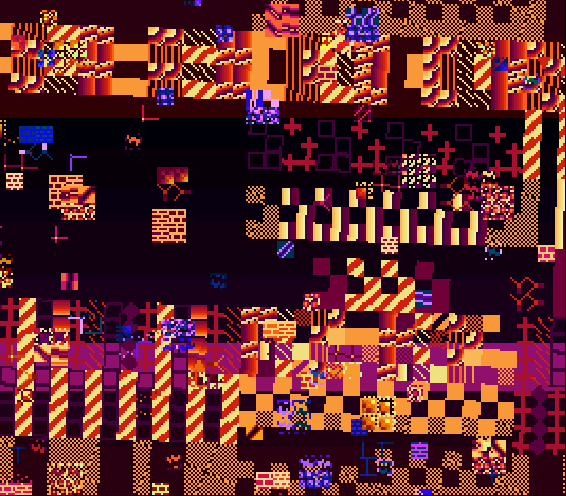
</p>
<p align="center">
  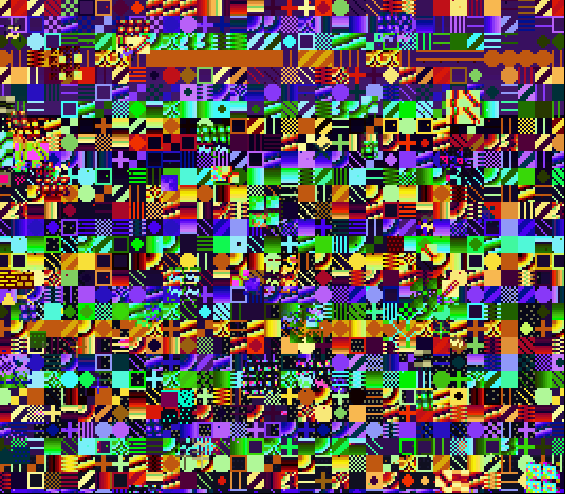
  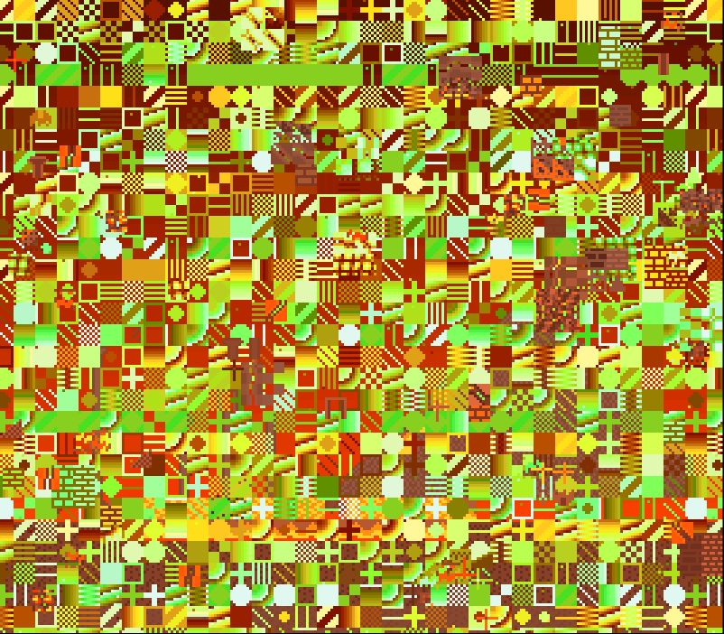
  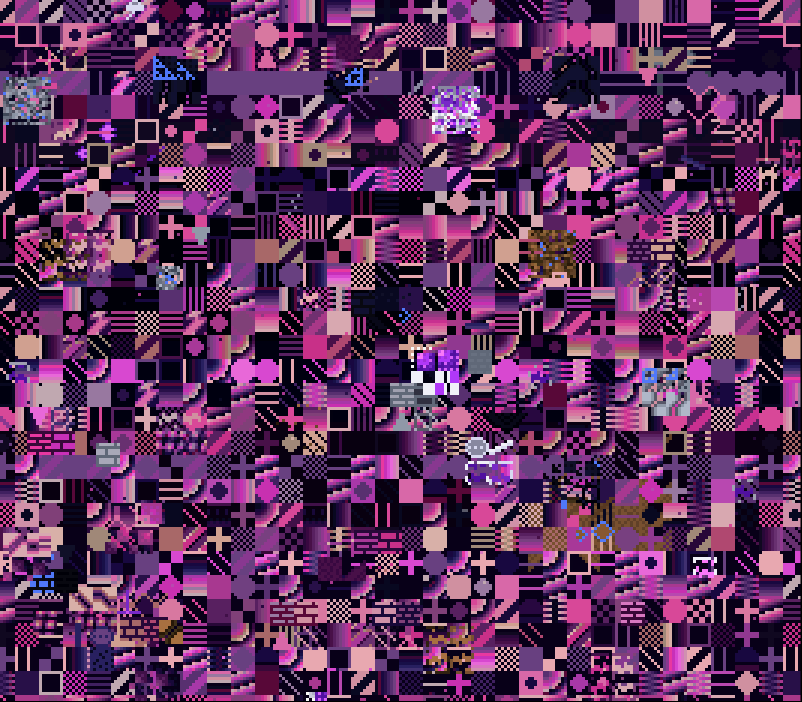
</p>

---

## Quick Start

Open any HTML file in a browser — no server required:

| File | Purpose |
|---|---|
| `index.html` | Interactive viewer with menu + gamepad support |
| `streaming.html` | Ambient TV background — zero input, smooth transitions, curated playlist, capped glitch intensity |
| `render.html` | Offline video export (MP4/WebM/PNG frames) with sequence builder |

---

## Controls

### Keyboard

| Key | Action |
|---|---|
| Escape / Tab | Toggle menu |
| Arrow keys | Navigate menu |
| Enter | Select |
| Backspace | Back |
| Space | Glitch burst |
| N / P | Next / previous scene |
| H | Toggle HUD |
| G | Toggle ghost frame |
| M | Toggle Mode 7 |
| F | Freeze animation |
| S | Screenshot |
| 1-9 | Lock glitch type |
| 0 | Auto glitch mode |

### Gamepad (PS5 / Xbox / Standard)

| Button | Action |
|---|---|
| Options / Start | Toggle menu |
| L1 / R1 | Previous / next scene |
| L2 / R2 | Cycle glitch type |
| Triangle / Y | Glitch burst |
| Square / X | Screenshot |
| D-pad / Left stick | Navigate menu |
| Cross / A | Select |
| Circle / B | Back |

Any input disables auto-advance. After 2 minutes idle, attract mode resumes.

### Menu System

<p align="center">
  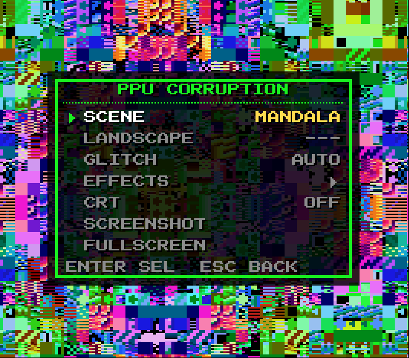
  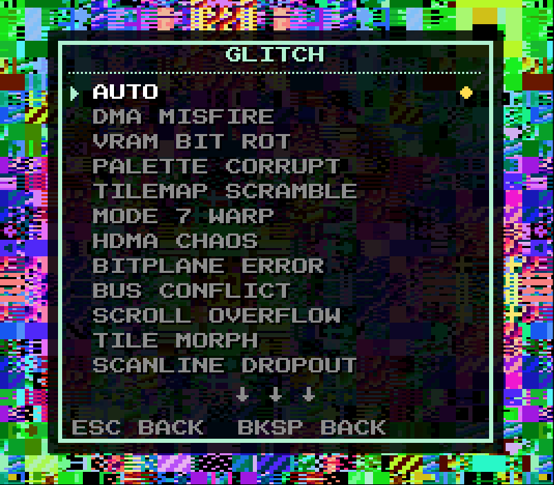
</p>

SNES-style bitmap font menu rendered directly into the PPU framebuffer. Navigate scenes, glitch modes, effects, CRT shader, and landscape biomes. Works with keyboard, gamepad, or PS5 DualSense controller.

---

## URL Parameters

All parameters work on `index.html` and `streaming.html`. Combine freely:

```
index.html?crt=true&scene=5&glitch=3
streaming.html?crt=true&barrel=0.06&bloom=0.5
```

### Engine

| Parameter | Default | Description |
|---|---|---|
| `scene` | random | Starting scene index (0-47, includes landscapes 38-47) |
| `glitch` | `0` | Lock glitch mode (0=auto, 1-21=specific glitch) |
| `ghost` | per-scene | Force ghost frame on/off (`true`/`false`) |
| `autoAdvance` | `true` | Auto-cycle through scenes (`true`/`false`) |

### CRT Shader

| Parameter | Default | Description |
|---|---|---|
| `crt` | `false` | Enable CRT post-processing |
| `scanlines` | `0.20` | Scanline darkening intensity (0-1) |
| `phosphor` | `0.15` | RGB aperture grille intensity (0-1) |
| `barrel` | `0.04` | Barrel distortion / screen curvature (0-0.2) |
| `bloom` | `0.30` | Bloom / bright pixel bleed (0-1) |
| `bloomRadius` | `1.5` | Bloom blur sample radius in texels |
| `chromatic` | `0.6` | Chromatic aberration in pixels at edges |
| `vignette` | `0.35` | Corner darkening intensity (0-1) |
| `noise` | `0.04` | Animated film grain intensity (0-0.2) |

### Preset Examples

```bash
# CRT installation with heavy curvature and bloom
index.html?crt=true&barrel=0.06&bloom=0.5&scanlines=0.3

# Lock on a landscape with no auto-advance
index.html?scene=25&autoAdvance=false&ghost=true

# Streaming with subtle CRT and forced ghost trails
streaming.html?crt=true&barrel=0.02&bloom=0.2&vignette=0.5

# Maximum CRT authenticity
index.html?crt=true&scanlines=0.25&phosphor=0.2&barrel=0.05&bloom=0.35&chromatic=0.8&vignette=0.4&noise=0.05
```

---

## Scenes

38 generative scenes, each with unique tile generation, palette, and corruption behavior. Scenes auto-advance every 20 seconds with mosaic fade transitions.

| # | Name | Description |
|---|---|---|
| 0 | GENESIS | Gentle scrolling with sine-wave movement and gradual tile morphing |
| 1 | DATA RAIN | Fast vertical scrolling with particle rain and DMA corruption bursts |
| 2 | CATHEDRAL | Symmetric stained glass patterns with slow meditative scroll and mosaic breathing |
| 3 | SIGNAL | Oscillating windows with neon palette, fast scrolling, and window masking |
| 4 | HORIZON | Mode 7 perspective floor with sunset palette and HDMA perspective scaling |
| 5 | FEEDBACK | Two inverted backgrounds with heavy cross-pollination feedback loops |
| 6 | RUINS | Architectural columns and arches with slow descent and DMA corruption |
| 7 | GLITCH STORM | Maximum chaos — all glitch types firing simultaneously |
| 8 | MANDALA | 4-way symmetric kaleidoscope with counter-rotating scrolls |
| 9 | DISSOLUTION | Accelerating corruption with progressive fade-to-black |
| 10 | PHOSPHOR | Slow diagonal scrolling with amber CRT phosphor palette and ghost trails |
| 11 | GRID | Strict grid pattern with neon palette and raster gradient |
| 12 | SYNTHWAVE | Mode 7 synthwave perspective with particle rise effects |
| 13 | MOSS | Organic overgrowth with infection-based tile morphing |
| 14 | INTERFERENCE | Dual background interference patterns with genome splice morphing |
| 15 | THERMAL | Infrared heat palette with pulsing thermal imaging simulation |
| 16 | WATERFALL | Wavy HDMA scroll with particle rain and column cascade morphing |
| 17 | SHATTER | Periodic glitch bursts (5x tilemap scramble + DMA misfire) |
| 18 | MIDNIGHT | Iris window closing/opening with ghost trails and particles |
| 19 | TAPESTRY | Diagonal stripe patterns with echoing and feedback tile morphing |
| 20 | STATIC | Rapid scrolling with constant VRAM corruption simulating static noise |
| 21 | PULSE | Mosaic breathing with fire palette and periodic tile morphing |
| 22 | DRIFTER | Mode 7 forest scene with slow rotation and peaceful floating |
| 23 | CORRUPTION GARDEN | Scattered clusters with frequent multi-phase tile morphing |
| 24 | RAVE | Oscillating windows with synthwave palette and alternating color math |
| 25 | RACING HORIZON | Mode 7 perspective racing floor with grid-pattern dither tiles |
| 26 | AURORA | HDMA wavy band displacement creating aurora borealis effect |
| 27 | DATASTREAM | Rapid vertical scrolling with parallax and bit rot cascade |
| 28 | KALEIDOSCOPE | Aggressive 4-way symmetric tilemap with periodic tile morphing |
| 29 | SUBMERGED | Underwater HDMA wavy displacement with slow peaceful drift |
| 30 | INFERNO | Fire rising with upward scrolling and aggressive palette corruption |
| 31 | TESSELLATION | Repeating geometric patterns with slow tile evolution |
| 32 | GHOST WORLD | Very slow scroll with high ghost alpha creating accumulated trails |
| 33 | CHROMATIC | Rapid palette corruption with periodic theme switching and color inversion |
| 34 | EARTHQUAKE | Violent random scroll shaking with constant tilemap scrambling |
| 35 | STARFIELD | Dark tilemap with sparse bright stars and very slow parallax drift |
| 36 | PRISM | Window-based prismatic color splitting with HDMA per-scanline displacement |
| 37 | CONVERGENCE | Two backgrounds on collision course with subtraction color math |

---

## Landscape Biomes

10 hand-composed landscape scenes with terrain, weather particles, parallax scrolling, day/night color cycling, and per-biome HDMA effects. Accessible via the menu or scene indices 38-47.

<p align="center">
  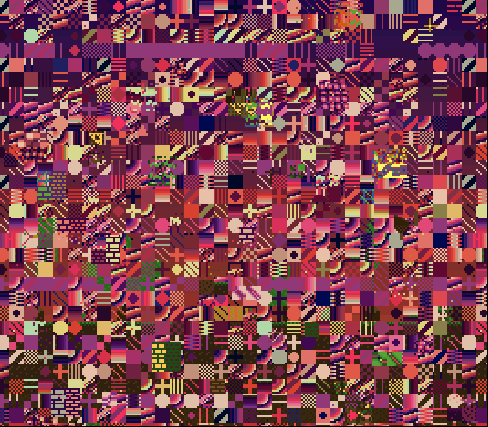
  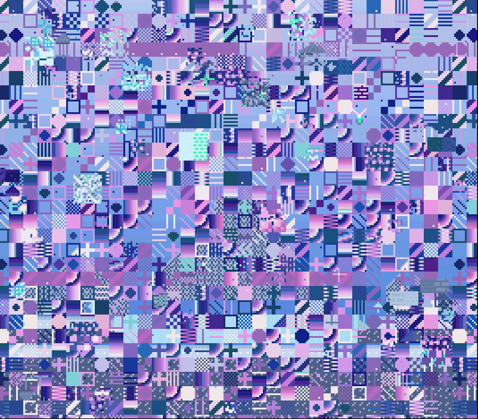
  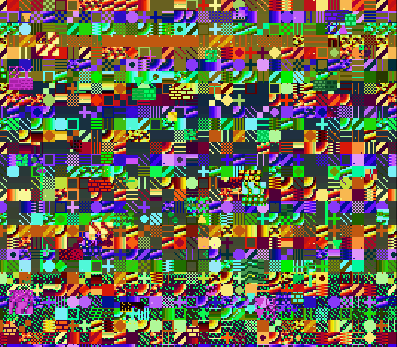
  
  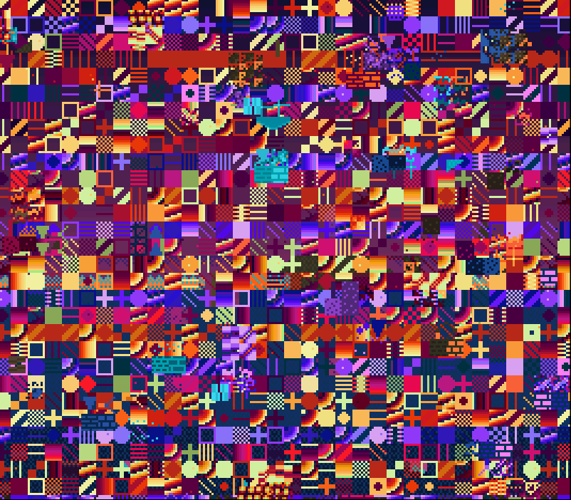
</p>
<p align="center">
  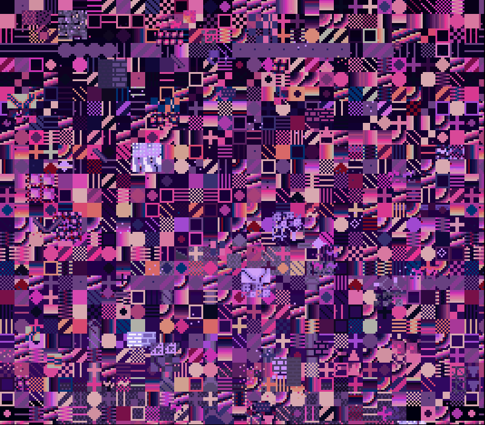
  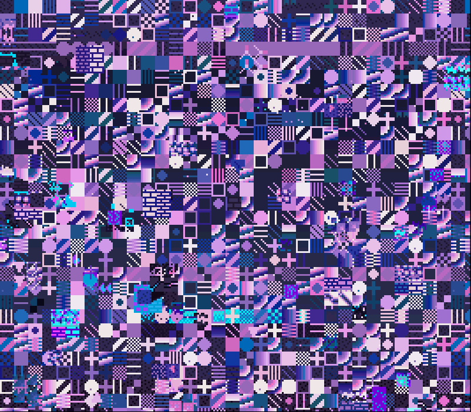
  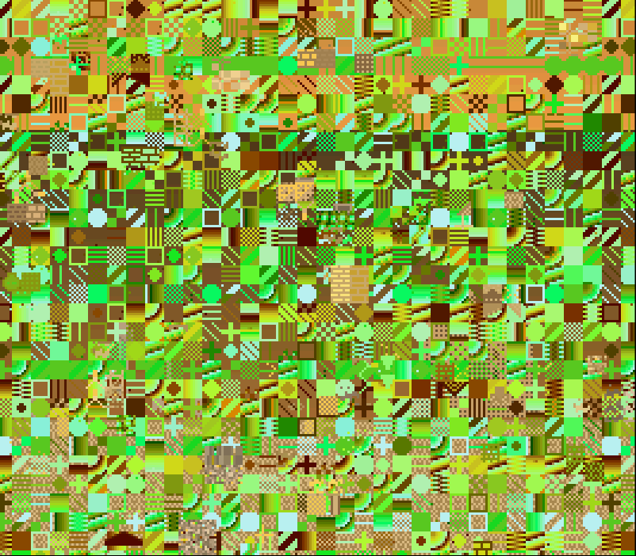
  
  
</p>

| # | Biome | Terrain | Weather / FX |
|---|---|---|---|
| 38 | Corrupted Forest | Pine/oak trees, pond clearing, mushrooms | Firefly sparkles, canopy flicker |
| 39 | Ice Wastes | Mountain range, frozen lake, ice crystals | Snow drifts, aurora shimmer |
| 40 | Alien Surface | Strange spires, bioluminescent pods, tendrils | Twin moons, bioluminescent pulse |
| 41 | Volcanic Ruins | Volcano with lava channel, ruined pillars | Smoke wisps, lava flow cycling |
| 42 | Digital Ocean | Water, island with data towers, sunset | Reflections, water shimmer |
| 43 | Void Temple | Temple facade, floating platforms, columns | Ethereal wisps, pulse glow |
| 44 | Crystal Cavern | Stalactites, crystal formations, underground river | Crystal shimmer, mineral veins |
| 45 | Desert Ruins | Rolling dunes, sphinx, half-buried archway | Heat shimmer, sand cycling |
| 46 | Neon City | Synthwave skyline, neon signs, puddle reflections | Traffic lights, fast neon cycling |
| 47 | Deep Space | Scattered stars, nebula, ringed planet, space station | Comet, nebula cycling |

---

## Glitch Algorithms

21 corruption algorithms that operate directly on PPU memory (VRAM, CGRAM, OAM, tilemaps, registers). In auto mode, glitches are randomly selected and layered. Lock a specific glitch with keyboard (1-9) or the menu.

| # | Name | What It Corrupts |
|---|---|---|
| 1 | DMA Misfire | Copies random VRAM chunks to tile data region |
| 2 | VRAM Bit Rot | Flips random bits in tile pixel data |
| 3 | Palette Corrupt | Rotates palettes, XORs colors, swaps channels, gradient fills |
| 4 | Tilemap Scramble | Shifts rows, flips H/V flags, overwrites tile indices |
| 5 | Mode 7 Warp | Corrupts affine matrix (rotation, scale, shear, offset) |
| 6 | HDMA Chaos | Injects per-scanline effects: wavy scrolls, mosaic gradients, color washes |
| 7 | Bitplane Error | Shifts bitplane pairs within tiles, misaligning color data |
| 8 | Bus Conflict | ORs/ANDs/XORs VRAM with random byte (simultaneous CPU/PPU access) |
| 9 | Scroll Overflow | Corrupts background scroll registers with random offsets |
| 10 | Tile Morph | Orchestrated 8-phase tile evolution system (see below) |
| 11 | Scanline Dropout | Drops 2-6 consecutive scanlines, filling with black or repeated lines |
| 12 | Address Line Fault | XORs tile index bits in tilemaps — all tiles read from wrong VRAM |
| 13 | HBlank Overflow | Shifts tile indices and palette bits in bottom half of screen |
| 14 | Register Desync | Swaps tilemap and character addresses between BG layers |
| 15 | OAM Corrupt | Scrambles sprite positions, tile indices, and attribute bits |
| 16 | CGRAM Shift | Rotates entire palette memory by 2-8 bytes, cyclically shifting colors |
| 17 | VRAM Fold | Copies VRAM chunk onto itself with offset, creating overlapping data |
| 18 | Mosaic Glitch | Enables extreme or mild pixelation |
| 19 | Color Math Swap | Toggles add/subtract/average blending on random backgrounds |
| 20 | Tilemap Mirror | Horizontally flips rectangular tilemap region and toggles H-flip flags |
| 21 | Bit Crush | Reduces color bit depth by masking R/G/B palette channels |

### Tile Morph System (Glitch #10)

The most complex corruption algorithm — 8 orchestrated phases that cycle every 120-300 frames with smooth transitions:

1. **Infection** — Copies tile data from infected source tiles to neighbors, creating hybrids through partial row transfers
2. **Splicing** — Breeds new tiles by interleaving bitplane rows from two parents (alternating rows, XOR crossover, bitwise interleave)
3. **Cross-Talk** — DMA-like corruption where tilemap data overwrites tile memory and vice versa (the map becomes texture)
4. **Wandering** — Tiles gradually drift through the tileset by accumulating fractional offsets, creating organic flowing morphing
5. **Feedback** — Reads an 8x8 region of tilemap entries as pixel data and writes them into tile memory, creating fractal-like patterns
6. **Cascade** — Reads which tiles a tilemap references, then corrupts those tiles through row shifting, bit-shifting, or mirroring
7. **Echoes** — Copies rectangular tilemap regions to nearby offsets with wrapping, creating stuttering/ghosting patterns
8. **Drag** — Smears tilemap entries horizontally by duplicating a single entry across neighboring cells with bit flipping

---

## Offline Rendering

<p align="center">
  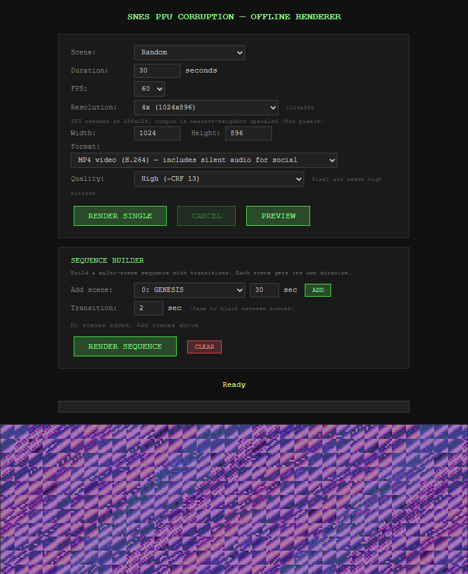
</p>

### Browser Export (`render.html`)

Single scene or multi-scene sequences with configurable fade-to-black transitions. The PPU renders at native 256x224, then nearest-neighbor upscales to the output resolution (fat pixels).

**Formats:**
- **MP4** (H.264) — includes silent audio track for social media compatibility
- **WebM** (VP9) — web-native
- **PNG frames** (ZIP) — best quality, use `encode.bat` for post-processing

**Resolution presets:**
- SNES integer scales: 2x (512x448) through 8x (2048x1792)
- Social: 1080p, 1080x1080 (Instagram square), 1080x1920 (Reels/TikTok), 4K

**Headless rendering** via URL params: `render.html?scene=0&duration=30&fps=60&auto=1`

### ffmpeg Encoding (`encode.bat`)

For PNG frame sequences — run in the folder containing `frame_*.png` files:

```
encode [fps] [--lossless]
```

Produces up to three outputs:
- **HQ** — yuv444p, CRF 10 (near-lossless, full chroma)
- **Social** — yuv420p + silent audio + H.264 Main profile + faststart (Instagram/TikTok/Twitter ready)
- **Lossless** (opt-in with `--lossless`) — yuv444p, CRF 0

---

## Technical Deep-Dive

### How the PPU Simulation Works

The engine simulates the Super Nintendo's Picture Processing Unit at the register level using typed arrays. All hardware memory is represented as flat byte arrays in the exact format the real hardware uses:

```
VRAM   — 64KB Uint8Array  (tile graphics + tilemaps)
CGRAM  — 512 bytes        (256 colors in 15-bit BGR)
OAM    — 544 bytes        (128 sprites + high table)
```

#### 4bpp Bitplane Tile Encoding

Each 8x8 tile occupies 32 bytes. The SNES stores pixel data in bitplanes rather than packed pixels — each bit of a pixel's color index is stored in a separate byte:

```
Bytes  0-15: Bitplanes 0 and 1 (interleaved, 2 bytes per row)
Bytes 16-31: Bitplanes 2 and 3 (interleaved, 2 bytes per row)

To decode pixel (x, row) of a tile at tileAddr:
  addr = tileAddr + row * 2
  bit  = 7 - x
  colorIdx = bit0(addr) | bit1(addr+1)<<1 | bit2(addr+16)<<2 | bit3(addr+17)<<3
```

This gives each pixel a 4-bit color index (0-15), selecting from one of 8 palettes of 16 colors each.

#### Tilemap Format

The 32x32 tilemap uses 2-byte entries that pack tile index, palette, flip flags, and priority into a single 16-bit word:

```
Byte 0: tile index (low 8 bits)
Byte 1: VHOPPPcc
  V = vertical flip    H = horizontal flip
  O = priority          PPP = palette (0-7)
  cc = tile index high bits (10-bit total)
```

This is why XOR/mask corruption operations on tilemap data produce such visually striking results — flipping a single bit can change which tile is displayed, which palette colors it, and whether it's flipped.

#### 15-bit BGR Color

Colors are stored in SNES format: `r:5 | g:5<<5 | b:5<<10` (BGR, not RGB). Each channel has 32 levels (0-31). The engine maintains a CGRAM cache that converts these to packed RGBA `Uint32` values once per frame, avoiding per-pixel conversion during rendering.

### Rendering Pipeline

Every frame follows the real SNES rendering order:

```
mainLoop()
  updateSceneDirector(deltaMs)     → scene transitions, call scene.update()
  updateColorCycling()             → rotate CGRAM ranges
  apply glitches                   → GLITCH_FNS[idx]()
  renderFrame()
    rebuildCGRAMCache()            → only if cgramDirty flag set
    per-scanline (0-223):
      applyHDMAEffects()           → per-scanline register overrides
      renderBGScanline() × 2       → or renderMode7Scanline()
      renderSpriteScanline()       → up to 32 sprites per line
      apply mosaic, window mask
    color math, ghost frame blend
  CRT shader (WebGL2 overlay)      → optional post-processing
```

Key performance techniques:
- **CGRAM dirty flag** — palette-to-RGBA conversion runs only when palettes change
- **Per-tile iteration** — tilemap entries fetched once per 8-pixel span, not per-pixel
- **Sine LUT** — 1024-entry `Float32Array` replaces `Math.sin/cos` in HDMA animations
- **Pre-allocated buffers** — `_lineBuffer` and `_priorityBuffer` reused every scanline, zero GC
- **Packed framebuffer** — `Uint32Array` of RGBA values, no object allocation for colors

### Extended PPU Features

Beyond the base PPU, the engine adds several extended features that interact with corruption:

| Feature | Description |
|---|---|
| Ghost Frame | Phosphor feedback — blends previous frame at configurable alpha, creating motion trails |
| Hardware Windows | 2 rectangular windows with modes (inside/outside/AND/XOR/OR) and actions (clip/color/invert) |
| Raster Bars | Per-scanline color gradients using SNES 15-bit BGR values |
| Color Cycling | Palette rotation on configurable CGRAM ranges (presets: full, slow, split, pulse, chase, breathe) |
| Color Math | Add/subtract/average blending between BG layers |
| HDMA | Per-scanline register writes for scroll, Mode 7, mosaic, and color effects |
| Sprites/Particles | Up to 128 sprites with 4 particle styles (scatter, rain, orbit, rise) |
| Mosaic | Block pixelation (1-16) used for scene transitions |

---

## Contributing New Content

### Adding a Scene

Add an object to `scenes[]` in `engine.js`:

```js
{
  name: "MY_SCENE",
  setup() {
    // MUST fully reset PPU state
    ppuMode = 1;
    bgEnabled[0] = true; bgEnabled[1] = true;
    generateTileData(); generateEnhancedTiles();
    generateTilemaps();
    generateThemedPalette("ocean");  // 16 themes available
    initColorCycling("pulse");       // 6 presets
    generateRasterGradient("sunset"); // 11 presets
    hdmaEffects = [];
    // Configure: ghost, windows, sprites, colorMath, scroll
  },
  update(localFrame) {
    // Per-frame animation — modify scroll, trigger glitches, etc.
    bgScrollX[0] += 1;
  }
}
```

Update `render.html` scene dropdown if it has a hardcoded list.

### Adding a Glitch Algorithm

1. Write a function in `ppu.js` that operates directly on `VRAM`, `CGRAM`, or `OAM`
2. Use `glitchRand()` / `glitchRandInt(n)` for seeded randomness (deterministic in offline renders)
3. Add to both `GLITCH_FNS[]` and `GLITCH_NAMES[]` at the same index

### Adding a Palette Theme

Add a case in `generateThemedPalette()` in `engine.js` — write 8 palettes x 16 colors to CGRAM, call `markCGRAMDirty()`.

Available themes: ocean, fire, forest, neon, ruins, blood, ice, void, stained, crt, amber, synthwave, moss, infrared, midnight, coral

### Adding a Landscape Biome

1. Write a `compose*()` function in `landscape.js` using `writeTilePixels()` and `writeTilemapEntry()`
2. Add palette generation case in `generateLandscapePalette()`
3. Add raster gradient case in `generateLandscapeRaster()`
4. Add entry to `LANDSCAPE_BIOMES[]` array

---

## Files

| File | Lines | Role |
|---|---|---|
| `ppu.js` | ~1900 | Core PPU simulation, VRAM/CGRAM/OAM, rendering pipeline, 21 glitch algorithms, tile morph system, sine LUT |
| `engine.js` | ~3400 | 38 scenes, scene director, tile generation, palettes, sprites, windows, ghost frame, raster bars, color cycling, HDMA |
| `landscape.js` | ~2300 | 10 landscape biomes with tile generators, composition functions, weather, parallax, color cycling |
| `menu.js` | ~1100 | 8x8 bitmap font, gamepad/keyboard menu overlay, attract mode |
| `crt.js` | ~440 | WebGL2 CRT post-processing shader (scanlines, phosphor, barrel, bloom, chromatic aberration, vignette, grain) |
| `encode.bat` | ~50 | ffmpeg wrapper for pixel-art-optimized video encoding from PNG frames |
| `index.html` | | Interactive viewer |
| `streaming.html` | | Ambient TV mode |
| `render.html` | | Offline video export with sequence builder |
